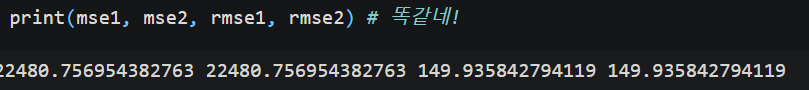
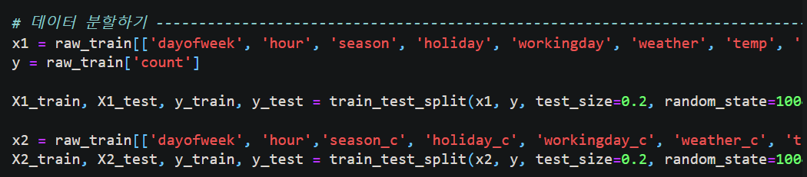
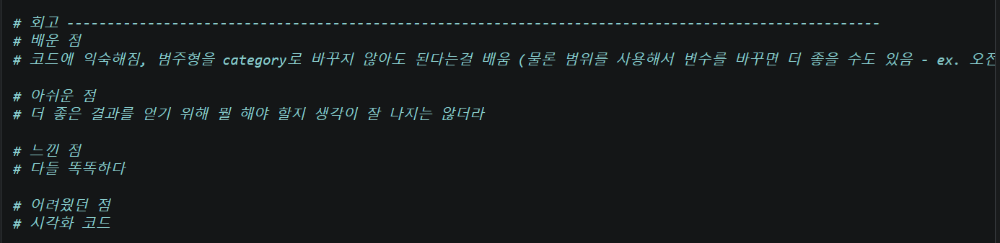

🔑 **PRT(Peer Review Template)**

- [O]  **1. 주어진 문제를 해결하는 완성된 코드가 제출되었나요? (완성도)**
    mse 150 이하
    

- [O]  **2. 프로젝트에서 핵심적인 부분에 대한 설명이 주석(닥스트링) 및 마크다운 형태로 잘 기록되어있나요? (설명)**
     이번 프로젝트 요구사항이 아님 

- [O]  **3. 체크리스트에 해당하는 항목들을 모두 수행하였나요? (문제 해결)**
    

- [O]  **4. 프로젝트에 대한 회고가 상세히 기록 되어 있나요? (회고, 정리)**
    
